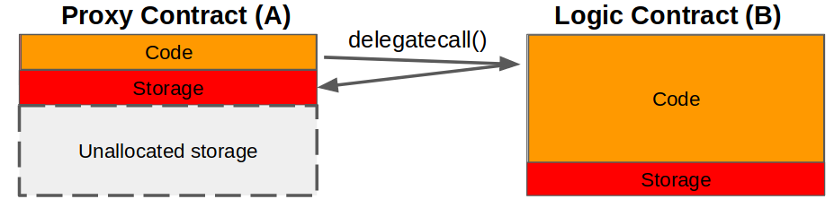

# Gem Contract Infrastructure

This repository contains the code for a set of smart contracts adhering to the ERC1155 Multi-Token Standard. They're developed to provide robust functionality for token management, role management, royalty management, as well as support for ERC165, ERC1155, ERC2981 interfaces, and a range of compliance, proxy deployment, proxy pattern adherence, event emission, and gas usage considerations.

`npx hardhat test`

## Proxy Pattern



- `delegatecall()` - Function in contract A which allows an external contract B (delegating) to modify A’s storage (see diagram below, Solidity docs)
- Proxy Contract - The contract A which stores data, but uses the logic of external contract B by way of `delegatecall()`.
- Logic Contract - The contract B which contains the logic used by Proxy Contract A
- Proxiable Contract - Inherited in Logic Contract B to provide the upgrade functionality

## Function Requirements

### System Initialization

```
1.1 The system should permit only a single initialization.
1.2 This initialization should set specified addresses as the default administrator and manager roles.
```

### Role Management

```
2.1 The system should implement role-based access control.
2.2 The system should have a role management system where roles can be granted to specific addresses.
2.3 An error should be thrown when attempting to grant a role to the zero address.
2.4 An error should be thrown when a non-admin user tries to grant a role.
2.5 An account with the DEFAULT_ADMIN_ROLE should be able to grant the MANAGER_ROLE.
2.6 An account without the DEFAULT_ADMIN_ROLE should not be able to grant the MANAGER_ROLE.
2.7 An account with the DEFAULT_ADMIN_ROLE should be able to revoke the MANAGER_ROLE.
2.8 An account without the DEFAULT_ADMIN_ROLE should not be able to revoke the MANAGER_ROLE.
2.9 Only an account with the DEFAULT_ADMIN_ROLE should be able to grant other roles.
2.10 Only an account with the DEFAULT_ADMIN_ROLE should be able to revoke other roles.
```

### Token Creation and Management

```
3.1 The system should provide the capability to mint new ERC1155 tokens.
3.2 Token minting should require specification of IDs and quantities, as well as target addresses.
3.3 The system should allow batch minting of tokens using arrays of IDs and respective quantities.
3.4 The system should permit the burning of tokens from specific addresses.
3.5 Token burning should require specification of token IDs and quantities.
3.6 The system should allow batch burning of tokens using arrays of IDs and respective quantities.
3.7 The system should provide functionality to safely transfer tokens from one address to another.
3.8 Token transfer should require specification of a token ID and quantity.
3.9 The system should provide functionality for safe batch transfer of tokens using arrays of IDs and respective quantities.
3.10 The system should not allow minting of new tokens without specific permissions.
3.11 The system should not allow burning of tokens without specific permissions.
3.12 The system should reject a token minting request if the requestor is not an owner of the contract.
3.13 The system should reject a token burn request if the requestor is not an owner of the contract.
```

### Manager Transferring

```
4.1 The system should allow the manager to safely transfer a token from one account to another.
4.2 Attempting to transfer a token from one account to another by a non-manager user should result in an error.
4.3 The system should allow the manager to safely transfer multiple tokens from one account to another.
4.4 Attempting to batch transfer tokens from one account to another by a non-manager user should result in an error.
4.5 The system should allow the manager to burn a token from one account.
4.6 Attempting to burn a token by a non-manager account should result in an error.
4.7 The system should allow the manager to batch burn tokens from one account.
4.8 Attempting to batch burn tokens by a non-manager account should result in an error.
```

### Royalty Management

```
5.1 The system should allow the setting of a default royalty for all tokens.
5.2 Default royalty setting should require specification of an address and fee numerator.
5.3 The system should permit the deletion of the default royalty.
5.4 The system should allow setting a royalty for a specific token.
5.5 Specific token royalty setting should require specification of an address and a fee numerator.
5.6 The system should allow the resetting of the royalty for a specific token.
5.7 The system should not allow setting of default royalty without the manager role.
5.8 An error should be thrown when attempting to delete the default royalty without the manager role.
5.9 The system should not allow setting of token royalty without the manager role.
5.10 An error should be thrown when attempting to reset the token royalty without the manager role.
```

### ERC165 Interface Support

```
6.1 The system should support the ERC165 interface.
6.2 The system should support the ERC1155 interface.
6.3 The system should support the ERC2981 interface.
6.4 The system should support the Access Control interface.
```

### ERC2981 Compliance

```
7.1 The function feeDenominator in the contract should return BASE_POINTS.
7.2 The function setDefaultRoyalty should correctly set a default royalty.
7.3 The function deleteDefaultRoyalty should correctly remove the default royalty.
7.4 The function setTokenRoyalty should correctly set a royalty for a specific token.
7.5 The function resetTokenRoyalty should correctly reset the royalty for a specific token.
7.6 The function royaltyInfo should correctly return royalty information for a token.
7.7 The function royaltyInfo should return zero royalty information for a token without a royalty.
```

### Proxy Contract Deployment

```
8.1 The system should provide functionality to deploy a new proxy contract.
8.2 Proxy contract deployment should initialize the contract with the caller as the owner.
8.3 This operation should only be callable from the singleton instance of the contract.
```

### ERC1155 Proxy Pattern

```
9.1 The ERC1155Proxy contract should delegate all calls to a separate implementation contract.
9.2 The address of the implementation contract should be set at the time of the proxy's construction and remain immutable afterwards.
9.3 The Beacon.sol and ERC1155BeaconProxy.sol should adhere to the ERC 1967 proxy pattern, enabling the upgrade of contract logic while maintaining state.
```

### Event Emission

```
10.1 The system should emit an Initialized event when a proxy contract is deployed.
10.2 Events for token minting and burning should accurately reflect the on-demand creation and destruction of tokens.
```

### Gas Usage Analysis

```
11.1 The system should provide predictable gas usage for the EVM.
11.2 The testing module should assess and report the gas usage for different operations including deploying contracts and minting tokens.
```
