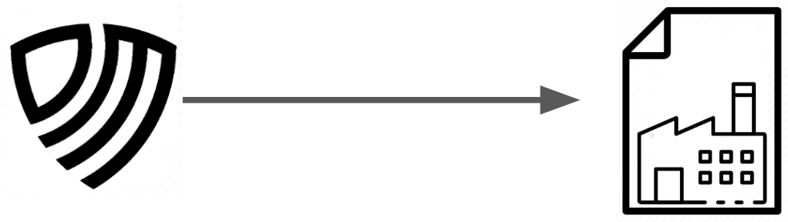
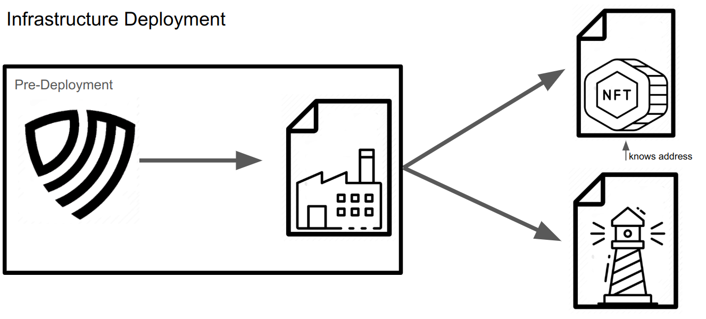
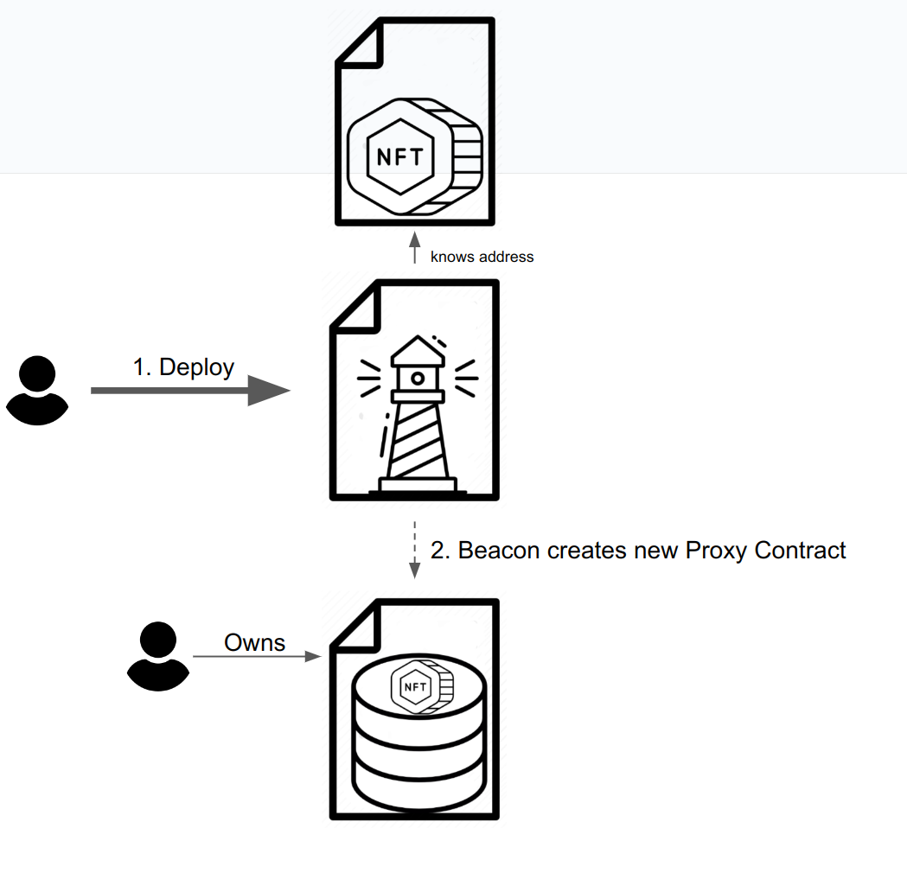
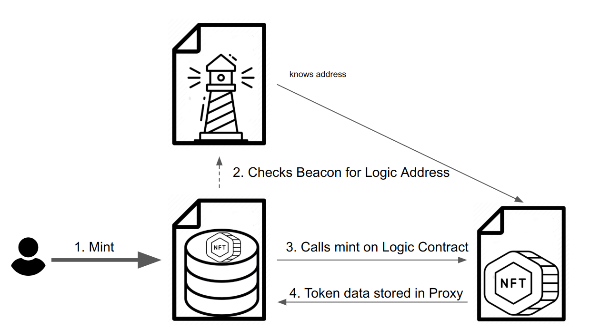
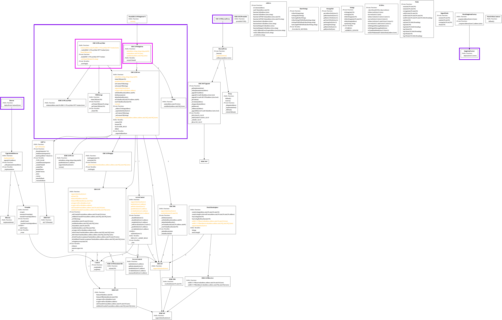

## Table of Contents

1. [Contract Infrastructure](#contract-infrastructure)
2. [Overview](#overview)
3. [Contract Addresses](#contract-addresses)
4. [Contract Inheritance Graph](#contract-inheritance-graph)
5. [Callouts and Assumptions](#callouts-and-assumptions)
6. [Slither Callouts](#slither-callouts)
7. [Gas Usage](#gas-usage)
8. [Function Requirements](#function-requirements)

# Contract Infrastructure

This repository contains the code for a set of smart contracts adhering to the ERC1155 Multi-Token Standard. They're developed to provide robust functionality for token management, role management, royalty management, as well as support for ERC165, ERC1155, ERC2981 interfaces, and a range of compliance, proxy deployment, proxy pattern adherence, event emission, and gas usage considerations.

`npx hardhat test`

## Overview

- A account launches a CREATE2 Factory contract on supported chains.



- The following contracts are launched, relying on the CREATE2 Factory for multichain address support.

* ERC1155 Standard Token Logic contract
* ERC1967 Beacon Proxy for Standard Token contract
* ERC1155 Lazy Mint Token Logic contract
* ERC1967 Beacon Proxy for Lazy Mint Token contract



- Users launch new token contracts through the respective Beacons for each token contract type. The Beacon will deploy an ERC1967 Proxy that relies on `delegatecall` to reference the Beacon implementation address for it's logic.





## Contract Addresses

Note: The contract versions deployed at these addresses are from git commit: 41c2f64ba4cbb174b1597c1c8404804f4fbdc930. Changes include mostly documentation and minor bugfix. The major change involves explicitly adding Re-entrancy guard to minting functions.

ERC1155 Standard Beacon: 0x9FBf72cF4825642ce904F00d3B52D643aC202045
ERC1155 Lazy Mint Beacon: 0x31e0296bC5bc6F3D36705721E630A8aE9Ff7FF87

https://etherscan.io/address/0x31e0296bC5bc6F3D36705721E630A8aE9Ff7FF87#code
https://sepolia.etherscan.io/address/0x31e0296bC5bc6F3D36705721E630A8aE9Ff7FF87

https://zkevm.polygonscan.com/address/0x31e0296bC5bc6F3D36705721E630A8aE9Ff7FF87#code
https://testnet-zkevm.polygonscan.com/address/0x31e0296bC5bc6F3D36705721E630A8aE9Ff7FF87#code

https://blockscan.com/address/0x31e0296bC5bc6F3D36705721E630A8aE9Ff7FF87

## Contract Inheritance Graph



Found inside the diagrams folder.

The purple outlines designate the original code written for this project.

# Callouts and Assumptions

1. A controlled account that owns the beacon contracts could upgrade the token implementations with malicious code.

Mitigation: Accepted risk. Ownership will eventually transfer to an organizational multisig wallet. ERC1967 also offers us `_setBeacon` that would allow users to deploy/designate their own beacons. This has not been implemented and is not currently roadmapped.

2. Lazy Mint does not use a withdrawal pattern.

Mitigation: The standard/accepted Lazy Mint contract implements the withdrawal pattern. This was changed to match the behavior of a Seaport order because relies on Seaport Protocol to manage sale/escrow of tokens after their initial purchase and this avoids the user education hurdle where some transactions would land in their wallet, and others would require them to withdraw for each collection, or require additional development, etc.

3. Although ERC2981 Royalty Standard designs for royalties to be granular to the individual token we only intend to support royalties at the collection level, setting the default royalty is enough. The logic exists for token-level granularity for consistency to avoid bespoke or unnecessary code.

4. Use of `unchecked` for incrementing token ids.

Mitigation: The practical limits token minting, block gas, and the human lifespan. E.g. (2^256 -1) / 500 (500 is the approx max tokens minted in batchMint) = 2 x 10^74 blocks or ~ 8 x 10^67 years.

5. Lazy Mint `redeem` forwards overpayments to the royalty receiver, reverts on underpayment.

## Slither callouts

OpenZeppelin reports omitted.

`$ slither .`

### High Risk:

```
MockMarketplace.buyListingPayRoyalty(uint256) (contracts/mocks/MockMarketplace.sol#87-123) sends eth to arbitrary user
Reference: https://github.com/crytic/slither/wiki/Detector-Documentation#functions-that-send-ether-to-arbitrary-destinations
```

**Mitigation**: Ignore
MockMarketplace, and other Mock contracts, are out of scope for the security audit.

### Medium Risks:

```
Reentrancy in ERC1155Singleton.mint(address,uint256,bytes) (contracts/ERC1155Singleton.sol#35-45):
        External calls:
        - _mint(to,currentTokenId,amount,data) (contracts/ERC1155Singleton.sol#40)
                - IERC1155Receiver(to).onERC1155Received(operator,from,id,amount,data)
```

**Mitigation**: ReentrancyGuard nonReentrant modifier is present on mint.

```
Reentrancy in ERC1155LazyMint.redeem(address,uint256,IERC1155LazyMint.NFTVoucher,bytes) (contracts/ERC1155LazyMint.sol#28-71):
        External calls:
        - _mint(signer,voucher.tokenId,quantity,signature) (contracts/ERC1155LazyMint.sol#55)
                - IERC1155Receiver(to).onERC1155Received(operator,from,id,amount,data)
```

**Mitigation**: ReentrancyGuard nonReentrant modifier is present on redeem.

For some reason slither does not call out mintBatch on ERC1155Singleton.sol. mintBatch is also protected by nonReentrant.

### Low Risks:

Reported Low risks are accepted, benign or mitigated in Medium Risks.

# Gas Usage

Gas Usage reports are included in the unit tests:

```

Gas used for SingletonFactory: 320267
Gas used for ERC1155Singleton: 5116860
Gas used for Beacon: 1449876
Gas used for Proxy: 699330
Gas used for mint: 108109
Maximum batchMint: 500 tokens for total gas: 23594774
Gas used to transfer a token: 65171

```

# Function Requirements

### System Initialization

```

1.1 The system should permit only a single initialization.
1.2 This initialization should set specified addresses as the default administrator and manager roles.

```

### Role Management

```

2.1 The system should implement role-based access control.
2.2 The system should have a role management system where roles can be granted to specific addresses.
2.3 An error should be thrown when attempting to grant a role to the zero address.
2.4 An error should be thrown when a non-admin user tries to grant a role.
2.5 An account with the DEFAULT_ADMIN_ROLE should be able to grant the MANAGER_ROLE.
2.6 An account without the DEFAULT_ADMIN_ROLE should not be able to grant the MANAGER_ROLE.
2.7 An account with the DEFAULT_ADMIN_ROLE should be able to revoke the MANAGER_ROLE.
2.8 An account without the DEFAULT_ADMIN_ROLE should not be able to revoke the MANAGER_ROLE.
2.9 Only an account with the DEFAULT_ADMIN_ROLE should be able to grant other roles.
2.10 Only an account with the DEFAULT_ADMIN_ROLE should be able to revoke other roles.

```

### Token Creation and Management

```

3.1 The system should provide the capability to mint new ERC1155 tokens.
3.2 Token minting should require specification of IDs and quantities, as well as target addresses.
3.3 The system should allow batch minting of tokens using arrays of IDs and respective quantities.
3.5 Token burning should require specification of token IDs and quantities.
3.6 The system should allow batch burning of tokens using arrays of IDs and respective quantities.
3.7 The system should provide functionality to safely transfer tokens from one address to another.
3.8 Token transfer should require specification of a token ID and quantity.
3.9 The system should provide functionality for safe batch transfer of tokens using arrays of IDs and respective quantities.
3.10 The system should not allow minting of new tokens without specific permissions.
3.11 The system should not allow burning of tokens without specific permissions.
3.12 The system should reject a token minting request if the requestor is not an owner of the contract.

```

### Royalty Management

```

5.1 The system should allow the setting of a default royalty for all tokens.
5.2 Default royalty setting should require specification of an address and fee numerator.
5.3 The system should permit the deletion of the default royalty.
5.4 The system should allow setting a royalty for a specific token.
5.5 Specific token royalty setting should require specification of an address and a fee numerator.
5.6 The system should allow the resetting of the royalty for a specific token.
5.7 The system should not allow setting of default royalty without the manager role.
5.8 An error should be thrown when attempting to delete the default royalty without the manager role.
5.9 The system should not allow setting of token royalty without the manager role.
5.10 An error should be thrown when attempting to reset the token royalty without the manager role.

```

### ERC165 Interface Support

```

6.1 The system should support the ERC165 interface.
6.2 The system should support the ERC1155 interface.
6.3 The system should support the ERC2981 interface.
6.4 The system should support the Access Control interface.

```

### ERC2981 Compliance

```

7.1 The function feeDenominator in the contract should return BASE_POINTS.
7.2 The function setDefaultRoyalty should correctly set a default royalty.
7.3 The function deleteDefaultRoyalty should correctly remove the default royalty.
7.4 The function setTokenRoyalty should correctly set a royalty for a specific token.
7.5 The function resetTokenRoyalty should correctly reset the royalty for a specific token.
7.6 The function royaltyInfo should correctly return royalty information for a token.
7.7 The function royaltyInfo should return zero royalty information for a token without a royalty.

```

### Proxy Contract Deployment

```

8.1 The system should provide functionality to deploy a new proxy contract.
8.2 Proxy contract deployment should initialize the contract with the caller as the owner.
8.3 This operation should only be callable from the singleton instance of the contract.

```

### ERC1155 Proxy Pattern

```

9.1 The ERC1155Proxy contract should delegate all calls to a separate implementation contract.
9.2 The address of the implementation contract should be set at the time of the proxy's construction and remain immutable afterwards.
9.3 The Beacon.sol and ERC1155BeaconProxy.sol should adhere to the ERC 1967 proxy pattern, enabling the upgrade of contract logic while maintaining state.

```

### Event Emission

```

10.1 The system should emit an Initialized event when a proxy contract is deployed.
10.2 Events for token minting and burning should accurately reflect the on-demand creation and destruction of tokens.

```

### Gas Usage Analysis

```

11.1 The system should provide predictable gas usage for the EVM.
11.2 The testing module should assess and report the gas usage for different operations including deploying contracts and minting tokens.

```

```

```
